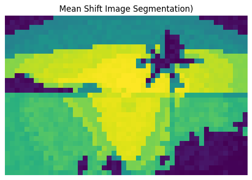

# Image Segmentation using Mean Shift Algorithm

This notebook performs image segmentation using the Mean Shift algorithm. It segments an input image into regions based on color similarity. The algorithm still need to be optimzed since the running time is approximately 1 minute for a small image of size 50x33.

## Prerequisites

- Python (version 3.0 or above)
- PIL (Python Imaging Library)
- NumPy
- Matplotlib

## Project structure

The project is generally structured as follows:
```
root/
├─ DM_pj_oop.ipynb
├─ sun.jpg
├─ sun-1.jpg
├─ Kmeans.png
├─ Meanshift.png
```

The main code is stored in a notebook "DM_pj_oop.ipynb", I used the notebook here to make a better illustration of the process.

## Getting Started

1. Clone the repository or download the script directly.

2. Install the required dependencies by running the following command: 
   ```pip install pillow numpy matplotlib```

3. Place your input image in the same directory as the script. Ensure that the image file is in a supported format (e.g., JPG, PNG).

4. Update the script with the filename of your input image (In the main part):
    ```python
    image = Img("sun.jpg")
    ```
5. The segmented image will be displayed and saved as "Meanshift.png" in the same directory.

## Result

This is the result after using Meanshift clustering with flat kernel:
<br>
**Mean Shift Clustering with Flat Kernel:**
<br>

<br>
Howerver there are still some flaw in my implementation, the running time is very slow, for a resized image of size 50x33 the running time is approximately 1 minute, so for every images that are very big, I have to resize it first. Also the number of cluster is about 30% of the original number of unique color which is still really large number of clusters.

When changing from flat kernel to gaussian kernel, the running time is about 16 times longer and also have larger number of clusters, but somehow, as presented in the image I think the result of gaussian kernel is better:
<br>
**Mean Shift Clustering with Gaussian Kernel:**
<br>

<br>

Compare to Kmeans, Kmeans seem to have better performance since it process the image really fast and also be able to make some very small number of cluster. Below is the result of Kmeans:
<br>
**Kmeans Clustering**
<br>

<br>

## References
Data Mining course's Slide: https://moodle.usth.edu.vn/pluginfile.php/29630/mod_resource/content/3/4.%20clustering.md.pdf 
